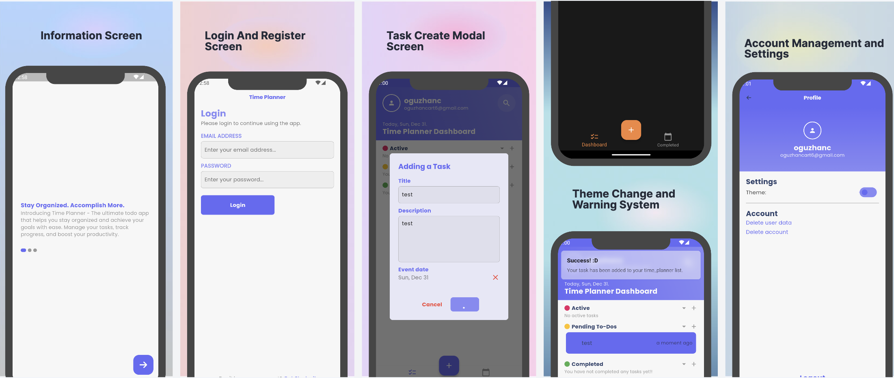

 
# 
 Time Planner  

 <b>Time Planner - You can now use your time efficiently with quick time management and planning with Time Planner. With Firebase DB, you can check the work you have completed, and with the change of theme, you can work in an interface according to your taste.</b>
 

## Badges

Use it as you want

 
## Making
- Ease of Use.
- Flutter
- Firebase DB, Auth
- Kanban Board
  
## Screenshots 
 

  
 

 

